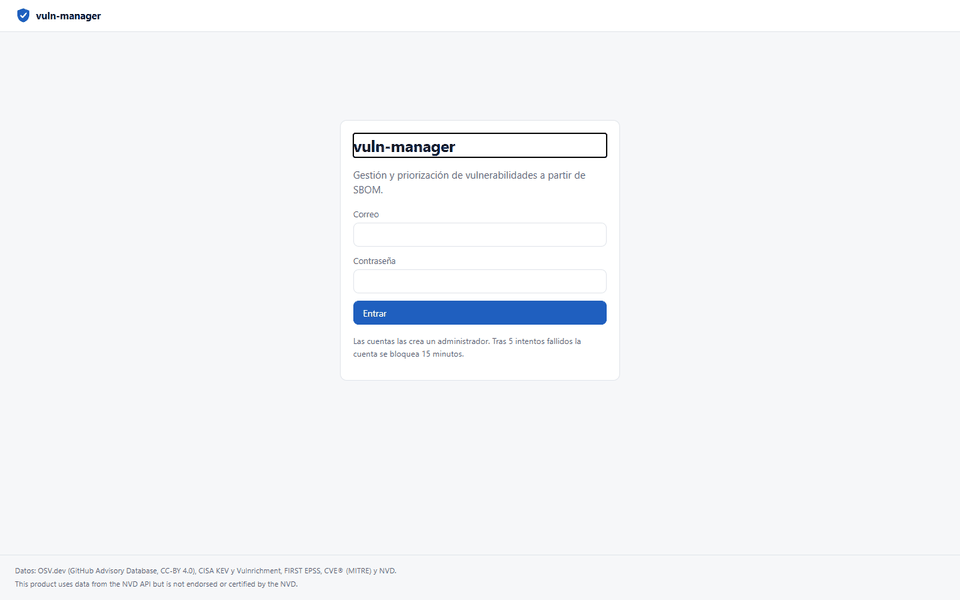
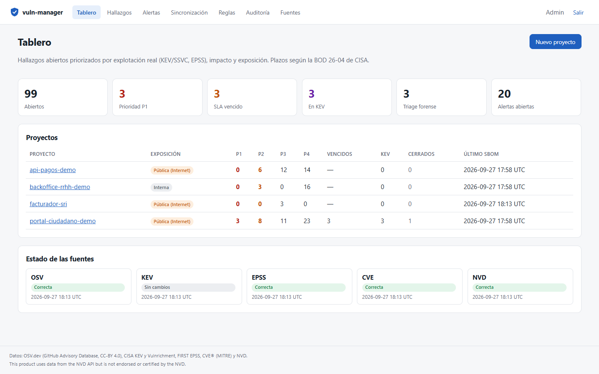
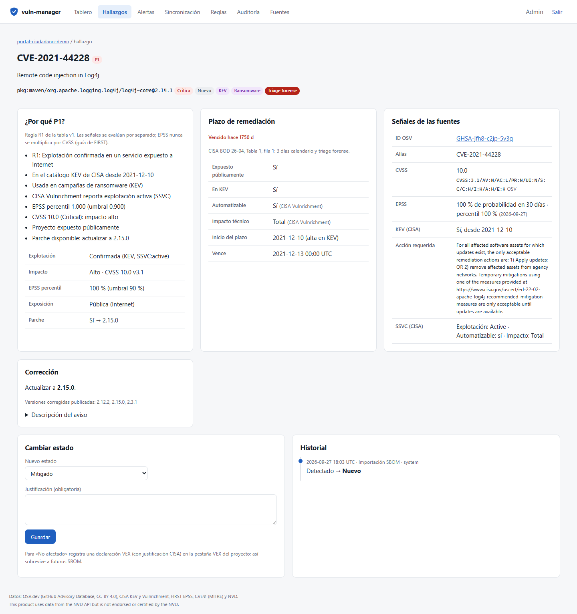
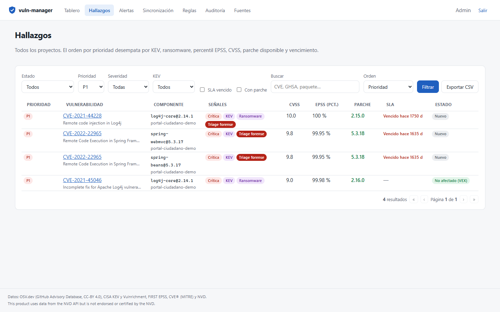
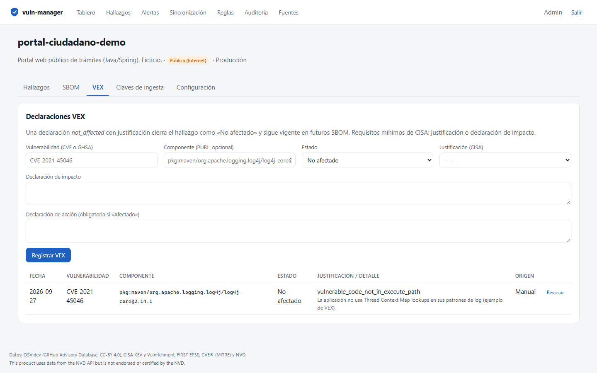
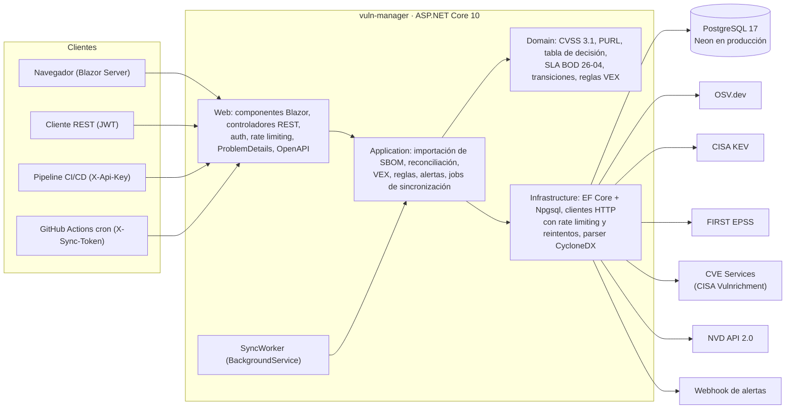
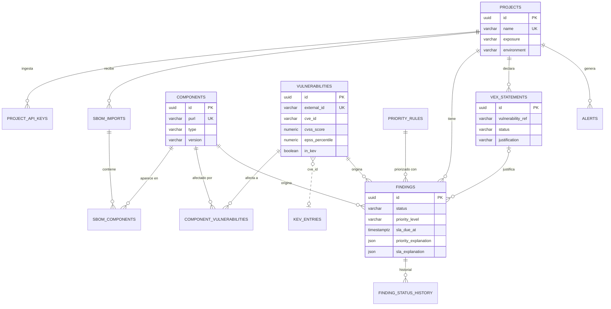

# vuln-manager — priorización de vulnerabilidades a partir de SBOM

Plataforma que **ingesta SBOM CycloneDX**, cruza cada componente con **OSV.dev** y lo enriquece con **CISA KEV, SSVC (Vulnrichment), FIRST EPSS, CVE Services y NVD**. Prioriza con una **tabla de decisión explicable**, no solo con CVSS. Los plazos de remediación salen de la **BOD 26-04 de CISA**. Incluye VEX con justificación registrada, alertas, historial de estados, exportación CSV y una API REST documentada.

[](https://github.com/DiegoFranciscoG/vuln-manager/actions/workflows/ci.yml)


## Demo en vivo y usuario de prueba

La demo pública (Render free + Neon) aún no está publicada; los pasos están en [Despliegue](#despliegue).

En local, `docker compose up --build` levanta todo con **datos de ejemplo ficticios**: tres proyectos demo y los SBOM de paquetes públicos con vulnerabilidades conocidas (Log4Shell, Spring4Shell…). Los usuarios `admin@vulnmanager.test`, `analyst@vulnmanager.test` y `viewer@vulnmanager.test` se crean **solo** con las contraseñas que definas en tu `.env`. No hay credenciales por defecto.

## Capturas



| Tablero | Detalle explicado de un hallazgo |
|---|---|
|  |  |
| **Hallazgos P1 con señales** | **VEX con justificación** |
|  |  |

Las capturas las genera la prueba E2E con Playwright (`tests/VulnManager.E2ETests`) contra el stack de Docker.

## El problema que resuelve

Un escáner de dependencias típico devuelve cientos de CVE ordenados por CVSS. Un CVSS 9.8 que nadie explota queda por encima de un 7.5 que está en el catálogo KEV y tiene ransomware asociado. Los equipos pierden tiempo en ruido, y sin un registro de *por qué* se descartó algo, la decisión se repite en cada auditoría.

vuln-manager responde tres preguntas por cada hallazgo:

1. **¿Qué arreglo primero?** Una tabla de decisión estilo SSVC combina explotación real (KEV/SSVC y EPSS por percentil), impacto y exposición del servicio. Cada prioridad guarda su explicación.
2. **¿Para cuándo?** El plazo sale de la Tabla 1 de la BOD 26-04: exposición pública, KEV, *automatable* e impacto técnico. Muestra una cuenta regresiva y el triage forense cuando corresponde.
3. **¿Por qué no aplica?** Las declaraciones VEX (CISA / CycloneDX 1.7) con justificación obligatoria cierran el hallazgo como «No afectado» y se mantienen en futuros SBOM.

## Funcionalidades

- **Ingesta de SBOM CycloneDX 1.4–1.7** (JSON, máx. 10 MiB) desde la UI o desde CI con **API keys por proyecto**. Es idempotente: si reenvías el mismo archivo, recibes la importación existente.
- **Identidad de componentes por PURL** (ECMA-427) y cruce con OSV `querybatch`. Los alias GHSA ↔ CVE se deduplican.
- **Enriquecimiento programado** (`BackgroundService`):
  - Fuentes: KEV con GET condicional, EPSS, CVE Services (CISA-ADP SSVC) y NVD solo para CVSS faltante.
  - **Límites de cada API**: NVD usa una ventana móvil de 5 peticiones por 30 s (sin clave), probada con `FakeTimeProvider`.
  - Reintentos que respetan `Retry-After`.
- **Prioridad configurable y versionada**: reglas R1–R7 (P1–P4). Se valida que cubran las 12 combinaciones de señales. Cada versión es inmutable, se audita, y activarla recalcula todo.
- **SLA**: BOD 26-04 (por defecto) o días por severidad, con cuenta regresiva, estado vencido y alertas «por vencer».
- **Estados con historial**:
  - Nuevo, Mitigado, Falso positivo, Riesgo aceptado (con fecha límite), No afectado (VEX) y Corregido.
  - Toda transición manual requiere justificación.
- **VEX**: declaraciones manuales o documentos CycloneDX VEX, cada una con justificación, declaración de impacto y origen.
- **Alertas** de nuevo P1, coincidencia KEV, SLA por vencer o vencido y triage forense. Se deduplican y se envían por webhook HTTPS opcional (Slack/Discord/Teams).
- **Exportación CSV** con los filtros activos, protegida contra inyección de fórmulas.
- **Roles**: Admin, Analyst y Viewer. Se accede con cookie (UI), JWT de 15 min (API) o API key (ingesta).
- **Auditoría de solo inserción**, garantizada por un trigger de PostgreSQL, con retención configurable (LOPDP).

## Arquitectura



El código está en capas con dependencias hacia adentro:
- `Domain` no depende de nada.
- `Application` define interfaces (repositorios y clientes externos) y DTOs.
- `Infrastructure` implementa esas interfaces.
- `Web` compone todo.

## Stack y por qué

| Pieza | Versión | Por qué |
|---|---|---|
| .NET / ASP.NET Core | 10.0.12 LTS (SDK 10.0.401) | Soporte hasta noviembre de 2028; una sola app para la API y la UI |
| Blazor Web App | Interactive Server + SSR estático | UI rica sin un segundo proyecto ni exponer tokens en el navegador. El login y las páginas públicas son SSR |
| EF Core + Npgsql | 10.0.12 / 10.0.3 | Migraciones versionadas, consultas parametrizadas y `snake_case` con EFCore.NamingConventions |
| PostgreSQL | 17.11 | CHECK, índices parciales, triggers de solo inserción y `json` / `jsonb` |
| Microsoft.Extensions.Http.Resilience | 10.10.0 | Reintentos con backoff y jitter que respetan `Retry-After` |
| CycloneDX.Core | 12.1.2 | Parser oficial de la especificación |
| Argon2id (Konscious) | 1.3.1 | Hash de contraseñas con los parámetros de OWASP |
| Serilog | 10.0.0 | Logs JSON compactos |
| xUnit v3 · Testcontainers · WireMock.Net · Playwright | 4.0.1 · 4.15.0 · 2.18.0 · 1.63.0 | Pruebas unitarias, de integración con PostgreSQL real y APIs simuladas, y E2E |
| Docker | `aspnet:10.0.12-noble-chiseled-extra` | Imagen sin shell ni gestor de paquetes, usuario no root |

## Modelo de datos



El detalle completo está en [docs/modelo-datos.md](docs/modelo-datos.md): 16 tablas, restricciones, índices y reglas de negocio con su fuente.

## Cómo ejecutar en local

### Con Docker (recomendado)

```bash
cp .env.example .env
```

Completa `.env`: `POSTGRES_PASSWORD`, `JWT_SECRET` (por ejemplo, con `openssl rand -base64 48`) y las contraseñas de los usuarios demo. Luego:

```bash
docker compose up --build
```

- App: <http://127.0.0.1:8080> · Swagger UI: <http://127.0.0.1:8080/swagger> · Salud: `/health/live` y `/health/ready`.
- Al arrancar aplica las migraciones, carga los proyectos demo y hace la primera sincronización con las APIs públicas (1–3 minutos).
- Compose no arranca si falta un secreto obligatorio (`${VAR:?}`). El contenedor corre con `read_only`, sin capacidades (`cap_drop: ALL`) y con `no-new-privileges`.

### Sin Docker

Necesitas el SDK de .NET 10.0.401+ y un PostgreSQL 17 accesible:

```bash
dotnet user-secrets --project src/VulnManager.Web set "ConnectionStrings:Default" "Host=localhost;Database=vulnmanager;Username=postgres;Password=TU_CLAVE"
```

```bash
dotnet user-secrets --project src/VulnManager.Web set "Jwt:Secret" "UN_SECRETO_ALEATORIO_DE_32_BYTES_O_MAS"
```

```bash
dotnet user-secrets --project src/VulnManager.Web set "Seed:AdminEmail" "admin@vulnmanager.test"
```

```bash
dotnet user-secrets --project src/VulnManager.Web set "Seed:AdminPassword" "UNA_CONTRASEÑA_FUERTE"
```

```bash
dotnet run --project src/VulnManager.Web
```

En `Development`, la app migra, carga los datos demo y escucha en <http://localhost:5126>.

## Variables de entorno

| Variable de la app | En `.env` (compose) | Obligatoria | Descripción |
|---|---|---|---|
| `ConnectionStrings__Default` | se arma con `POSTGRES_PASSWORD` | Sí | PostgreSQL en formato clave=valor **o** URI `postgresql://…` (la que muestra Neon) |
| `Jwt__Secret` | `JWT_SECRET` | Sí | Al menos 32 bytes aleatorios. Sin él, la app no arranca |
| `Seed__AdminEmail` / `Seed__AdminPassword` | `SEED_ADMIN_EMAIL` / `SEED_ADMIN_PASSWORD` | Sí en compose | Administrador inicial (12+ caracteres, mayúscula, minúscula, número y símbolo) |
| `Seed__AnalystEmail` / `Seed__AnalystPassword` | `SEED_ANALYST_*` | No | Usuario Analyst de demo; si falta la contraseña, no se crea |
| `Seed__ViewerEmail` / `Seed__ViewerPassword` | `SEED_VIEWER_*` | No | Usuario Viewer de demo |
| `Seed__DemoData` | — | No (`false`) | Carga los 3 proyectos ficticios |
| `Database__ApplyMigrationsOnStartup` | — | No (`false`) | Aplica las migraciones al arrancar |
| `Sync__TriggerToken` | `SYNC_TRIGGER_TOKEN` | No | Token del cron (`POST /api/sync/trigger`). Vacío = endpoint deshabilitado |
| `Sync__Enabled` / `Sync__TickMinutes` | — | No (`true` / `15`) | Sincronización programada |
| `ExternalSources__NvdApiKey` | `NVD_API_KEY` | No | Clave gratuita de NVD: sube el límite de 5 a 50 peticiones por 30 s |
| `AlertWebhook__Url` / `AlertWebhook__PublicBaseUrl` | `ALERT_WEBHOOK_URL` | No | Webhook HTTPS de alertas y URL pública para los enlaces |
| `Cors__AllowedOrigins` | `CORS_ALLOWED_ORIGINS` | No | Orígenes explícitos separados por coma. Vacío = sin CORS |
| `ForwardedHeaders__Enabled` | — | No (`false`) | `true` detrás del proxy TLS de Render |
| `Security__SecureCookies` | — | No (`true`) | Solo el compose local (HTTP) lo pone en `false` |
| `Audit__RetentionDays` | — | No (`365`) | Retención de la auditoría (LOPDP, minimización) |

## API

Documentación interactiva en **`/swagger`**; el documento OpenAPI está en `/openapi/v1.json`. Hay ejemplos listos en [docs/api.http](docs/api.http).

| Método y ruta | Rol | Descripción |
|---|---|---|
| `POST /api/auth/token` | anónimo (10/min) | Email y contraseña → JWT de 15 min |
| `GET/POST /api/projects` | Viewer / Admin | Proyectos con contadores por prioridad |
| `POST /api/projects/{id}/sboms` | Analyst o API key | Sube un SBOM CycloneDX (multipart `file` o `application/vnd.cyclonedx+json`) |
| `POST /api/projects/{id}/api-keys` | Admin | Crea una clave de ingesta `vmk_…` (se muestra una sola vez) |
| `GET /api/findings` | Viewer | Filtros `status`, `priority`, `severity`, `inKev`, `overdue`, `fixAvailable`, `search` y `sort`, con paginación |
| `GET /api/findings/{id}` | Viewer | Detalle con la explicación de prioridad y SLA, señales e historial |
| `POST /api/findings/{id}/status` | Analyst | Triage con justificación obligatoria |
| `GET /api/findings/export.csv` | Viewer | Exporta los hallazgos filtrados |
| `POST /api/projects/{id}/vex-statements` · `POST /api/projects/{id}/vex` | Analyst | Declaración VEX manual o documento CycloneDX VEX |
| `GET/POST /api/priority-rules` · `POST /api/priority-rules/{id}/activate` | Viewer / Admin | Versiones de la tabla de decisión |
| `GET /api/alerts` · `POST /api/alerts/{id}/ack` | Viewer / Analyst | Alertas |
| `POST /api/sync` · `GET /api/sync/runs` | Admin / Viewer | Sincronización manual e historial (peticiones HTTP, respuestas limitadas, marca de agua) |
| `POST /api/sync/trigger` | `X-Sync-Token` (6/h) | Despertador para el cron |

Integración desde un pipeline:

```bash
curl -fsS -X POST -H "X-Api-Key: $VULNMANAGER_API_KEY" -H "Content-Type: application/vnd.cyclonedx+json" --data-binary @bom.json "$VULNMANAGER_URL/api/projects/$PROJECT_ID/sboms?sourceRef=$GITHUB_SHA"
```

## Tests y cobertura

| Suite | Pruebas | Qué cubre |
|---|---|---|
| Unitarias | 265 | CVSS 3.1 (vectores de FIRST), PURL, comparación de versiones, tabla de decisión con casos borde (sin EPSS, severidad desconocida, reglas no exhaustivas), timeline de la BOD 26-04, transiciones, VEX, rate limiter con `FakeTimeProvider`, clientes contra *fixtures* reales, parser CycloneDX, Argon2id, CSV |
| Integración | 36 | PostgreSQL real (Testcontainers) + APIs simuladas (WireMock): ingesta idempotente, **sincronización idempotente** (la segunda corrida actualiza 0), **límite de NVD medido**, VEX, triage, alertas, seguridad (deny-by-default, API keys por proyecto, JWT manipulado, rate limit del login, cabeceras, auditoría inalterable) |
| E2E | 3 | Playwright contra el stack de Docker: redirección a login, error genérico, flujo completo del admin y cierre de sesión (se omiten sin `E2E_BASE_URL`) |

**Cobertura de líneas**: 89,4 % en la lógica de negocio (Domain + Application), 77,7 % global. CI falla si Domain + Application baja del 70 %.

```bash
dotnet test --solution VulnManager.slnx
```

Para las pruebas E2E, con el stack arriba:

```bash
E2E_BASE_URL=http://127.0.0.1:8080 E2E_USER=admin@vulnmanager.test E2E_PASSWORD='tu-contraseña' E2E_SCREENSHOTS_DIR=docs/img dotnet test --project tests/VulnManager.E2ETests
```

**Verificación con un SBOM real**: el backend de otro proyecto del portafolio, con 124 componentes, produjo 3 hallazgos críticos en Tomcat embebido. Coinciden 3/3 con una consulta independiente a OSV. El detalle está en [docs/verificacion-sbom-real.md](docs/verificacion-sbom-real.md).

## Despliegue

Todo con planes gratuitos, cuyos límites se verificaron en septiembre de 2026:

1. **Neon (Free)**: crea un proyecto, porque Render Postgres free expira a los 30 días. Copia la cadena de conexión. La app acepta tanto la URI `postgresql://…?sslmode=require` como el formato .NET.
2. **Render (Free)**: *New › Blueprint* con este repositorio. [`render.yaml`](render.yaml) crea un servicio Docker con `healthCheckPath: /health/live`.
   - Pide en el panel `ConnectionStrings__Default`, `Seed__AdminPassword` y los opcionales.
   - Genera `Jwt__Secret` y `Sync__TriggerToken`.
3. **GitHub Actions**:
   - Define la variable `VULNMANAGER_URL` y el secreto `SYNC_TRIGGER_TOKEN`.
   - [`sync.yml`](.github/workflows/sync.yml) despierta el servicio cada 6 h (Render free duerme tras 15 min sin tráfico) y lanza la sincronización.
   - [`migrate.yml`](.github/workflows/migrate.yml) aplica las migraciones con un *bundle* y una identidad separada, si prefieres no migrar al arrancar.

Límites a tener en cuenta:
- Render free: 512 MB de RAM, 750 h al mes por workspace y bloqueo de SMTP (por eso las alertas van por webhook).
- Neon free: 0,5 GB por proyecto.

## Seguridad aplicada

- **Deny-by-default**: una política de autorización global exige usuario autenticado. Lo público se marca uno a uno (login, salud, OpenAPI, fuentes).
- **Autenticación**:
  - Cookie para la UI.
  - JWT HS256 de 15 min, con secreto ≥ 256 bits desde variables de entorno.
  - API keys por proyecto `vmk_{prefijo}_{secreto}`, guardadas como SHA-256, con expiración y revocación; cada una solo ve su proyecto.
- **Contraseñas**: Argon2id (m = 19 MiB, t = 2, p = 1). El bloqueo tras 5 intentos dura 15 min.
- **Rate limiting**:
  - Envíos de login: 10/min por IP. La vista del login no cuenta y, si se supera el límite, se muestra una página 429 en lugar de un bucle de redirecciones.
  - Ingesta: 30/min. Global: 600/min. Trigger de sincronización: 6/h.
- **Cabeceras**: CSP estricta (`script-src 'self'`), `X-Frame-Options: DENY`, `nosniff`, `Referrer-Policy: no-referrer`, `Permissions-Policy`, COOP/CORP y HSTS. Sin cabecera `Server`.
- **Validación**:
  - DataAnnotations en DTOs y enums con nombres definidos.
  - SBOM con tipo, tamaño (10 MiB) y esquema validados.
  - CSV protegido contra inyección de fórmulas.
- **Errores**: `ProblemDetails` sin stack traces, con `traceId` para soporte.
- **Datos**: SQL siempre parametrizado (EF Core). La auditoría es de solo inserción (trigger) y guarda identificadores, nunca emails (LOPDP: minimización y retención).
- **Secretos**: solo por entorno, sin valores por defecto. gitleaks corre en pre-commit y en CI.
- **Cadena de suministro**:
  - Acciones fijadas por SHA, con `permissions` mínimos.
  - Imágenes con versión exacta.
  - Trivy sobre la imagen (0 HIGH/CRITICAL).
  - SBOM propio de vuln-manager en cada build.
  - Dependabot.
- Revisado contra OWASP Top 10 y OWASP API Security Top 10. Detalle en [SECURITY.md](SECURITY.md).

## Decisiones técnicas

- **Tabla de decisión en lugar de una fórmula.** FIRST desaconseja multiplicar EPSS por CVSS. Una tabla estilo SSVC es explicable («R1: explotación confirmada en un servicio expuesto»), se puede auditar y se valida que sea exhaustiva.
- **Prioridad y plazo son independientes.** La prioridad ordena el trabajo; el SLA sale de la BOD 26-04. Un CVSS 9.8 sin explotación y expuesto puede ser P3 y aun así vencer en 3 días. Así ocurrió con Tomcat en la [verificación real](docs/verificacion-sbom-real.md).
- **PURL como identidad del componente.** Un mismo paquete en varios SBOM se cruza una sola vez con OSV. Los hallazgos se deduplican por (proyecto, componente, vulnerabilidad).
- **Idempotencia medida, no supuesta**:
  - Hash SHA-256 del SBOM y claves únicas.
  - ETag + `If-Modified-Since` para KEV.
  - Explicaciones guardadas como `json` (texto exacto) para que una explicación igual no se reescriba.
  - Timestamps truncados a microsegundos, como los guarda PostgreSQL.
- **Rate limiter propio para NVD**: una ventana móvil con espaciado mínimo e inyección de `TimeProvider`. Así se prueba en milisegundos que nunca hay más de 5 peticiones en 30 s.
- **VEX como dato de primera clase.** La justificación se guarda en su vocabulario de origen (CISA o CycloneDX) y sobrevive a nuevos SBOM. Revocarla reabre el hallazgo.
- **Monolito modular con Blazor Server.** Un solo despliegue gratuito, sin CORS ni tokens en el navegador. La API REST sirve a CI y a integraciones.

## Roadmap

- Importar VEX en formato CSAF 2.0 y OpenVEX.
- Soporte de SBOM SPDX 3.0.
- Diferencias entre dos SBOM de un proyecto (qué entró y qué salió).
- Comentarios automáticos en pull requests desde el pipeline.
- Inicio de sesión con OIDC (GitHub/Entra ID) y organizaciones con varios equipos.
- Histórico de EPSS por CVE para ver tendencias.

## Fuentes de datos y licencias

| Fuente | Uso | Licencia / aviso |
|---|---|---|
| [OSV.dev](https://osv.dev) (incluye GitHub Advisory Database) | Cruce componente → vulnerabilidad y versiones corregidas | Cada registro conserva la licencia de su fuente; GitHub Advisory Database: CC-BY 4.0 |
| [CISA KEV](https://www.cisa.gov/known-exploited-vulnerabilities-catalog) | Explotación confirmada, ransomware, inicio del plazo | Dominio público (U.S. Government) |
| [CISA Vulnrichment](https://github.com/cisagov/vulnrichment) vía [CVE Services](https://www.cve.org) | SSVC: Exploitation, Automatable, Technical Impact | CC0-1.0. CVE® es una marca registrada de The MITRE Corporation, usada bajo los CVE Terms of Use |
| [FIRST EPSS](https://www.first.org/epss/) | Probabilidad y percentil de explotación | Uso libre con atribución a FIRST |
| [NIST NVD](https://nvd.nist.gov) | CVSS cuando falta en las demás fuentes | *This product uses data from the NVD API but is not endorsed or certified by the NVD.* |
| [CISA BOD 26-04](https://www.cisa.gov/news-events/directives/bod-26-04-prioritizing-security-updates-based-risk) | Tabla 1 de plazos de remediación | Documento público del gobierno de EE. UU. |

Los datos de demostración son ficticios; los paquetes de los SBOM demo son públicos. Todas las fuentes, con fecha de consulta y supuestos, están en [docs/investigacion.md](docs/investigacion.md).

## Autor

Diego Francisco Granda Zhingre — [GitHub](https://github.com/DiegoFranciscoG) · [LinkedIn](https://www.linkedin.com/in/diego-francisco-g-61b793254/) · [Portafolio](https://diegofranciscog.github.io/)

Licencia [MIT](LICENSE).
