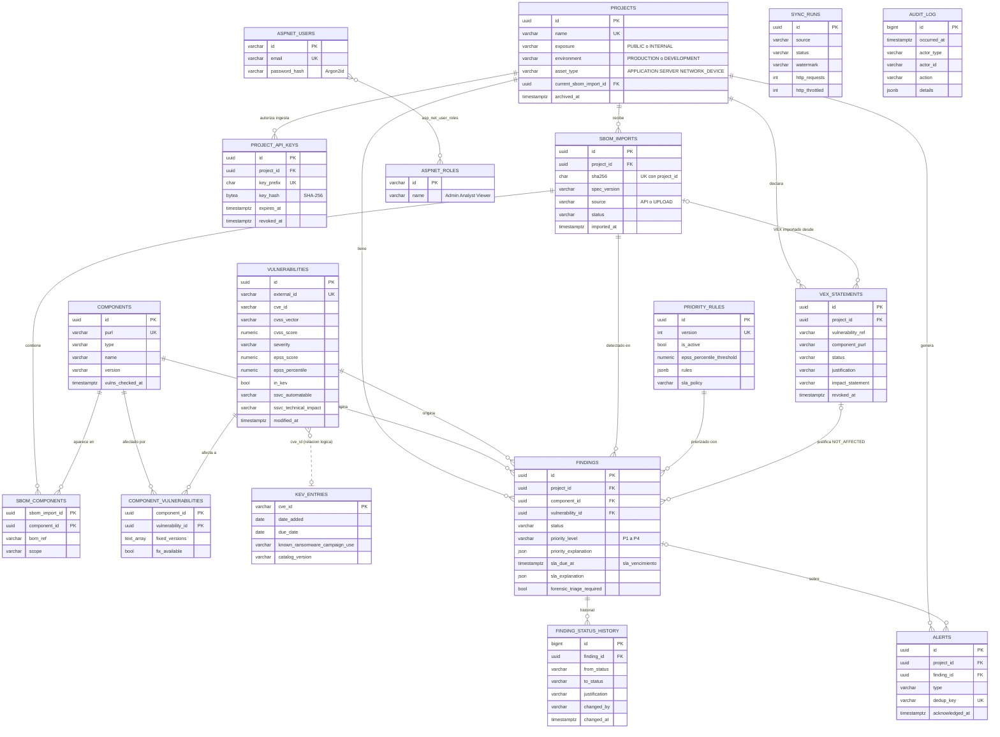

# Modelo de datos

Base de datos: **PostgreSQL** (Neon en producción, contenedor en local y en tests). ORM: **EF Core 10 + Npgsql**, con migraciones versionadas de EF Core (el equivalente .NET de Flyway o Alembic).

Convención: tablas y columnas en `snake_case` y en inglés, igual que el código. Las fechas se guardan como `timestamptz` en UTC. Los identificadores son `uuid` v7 generados en la aplicación, ordenables por tiempo. Los números `#N` remiten a [investigacion.md](investigacion.md).

| Nombre del enunciado | Tabla |
|---|---|
| proyectos | `projects` |
| componentes (PURL, versión) | `components` (+ `sbom_components`, `component_vulnerabilities`) |
| sbom_importados (origen, fecha, hash) | `sbom_imports` |
| vulnerabilidades (id, fuente, cvss, epss, en_kev, descripción) | `vulnerabilities` (+ `kev_entries`) |
| hallazgos (estado, sla_vencimiento) | `findings` (+ `finding_status_history`) |
| reglas_prioridad | `priority_rules` |
| auditoria | `audit_log` |
| *(agregadas)* VEX, alertas, sincronización, claves de ingesta | `vex_statements`, `alerts`, `sync_runs`, `project_api_keys` |

## 1. Diagrama ER



## 2. Tablas

### 2.1 `projects`

| Campo | Tipo | Restricción | Regla / fuente |
|---|---|---|---|
| id | uuid | PK | — |
| name | varchar(100) | NOT NULL, UNIQUE (índice sobre `lower(name)`) | — |
| description | varchar(500) | NULL | — |
| repository_url | varchar(300) | NULL; solo `https://` | Validación de entrada (#56 API8) |
| exposure | varchar(20) | NOT NULL, CHECK ∈ {`PUBLIC`,`INTERNAL`} | "Publicly exposed" Yes/No de la BOD 26-04 (#13, #14) |
| environment | varchar(20) | NOT NULL, CHECK ∈ {`PRODUCTION`,`DEVELOPMENT`} | Etiqueta de entorno exigida por la BOD 26-04 (#13) |
| asset_type | varchar(20) | NOT NULL, DEFAULT `APPLICATION`, CHECK ∈ {`APPLICATION`,`SERVER`,`NETWORK_DEVICE`} | Etiqueta de tipo de activo de la BOD 26-04 (#13) |
| current_sbom_import_id | uuid | FK → `sbom_imports`, NULL | El inventario vigente es el del último SBOM procesado |
| created_at / updated_at | timestamptz | NOT NULL | — |
| archived_at | timestamptz | NULL (borrado lógico) | Conserva la trazabilidad |
| xmin | xid | token de concurrencia optimista | — |

### 2.2 `project_api_keys` (ingesta desde CI, p. ej. el pipeline de P30)

| Campo | Tipo | Restricción | Regla / fuente |
|---|---|---|---|
| id | uuid | PK | — |
| project_id | uuid | FK → `projects` ON DELETE CASCADE | Cada clave sirve **solo para su proyecto** (#56 API1 BOLA) |
| name | varchar(100) | NOT NULL | — |
| key_prefix | char(8) | NOT NULL, UNIQUE | Identificador público de la clave |
| key_hash | bytea | NOT NULL, 32 bytes (SHA-256 del secreto) | El secreto son 32 bytes aleatorios y se muestra una sola vez. Al tener alta entropía, basta un hash rápido. |
| created_by | varchar(100) | NOT NULL (id del usuario) | Minimización (#58) |
| created_at | timestamptz | NOT NULL | — |
| expires_at | timestamptz | NOT NULL, ≤ 365 días | Credenciales de vida corta |
| last_used_at / revoked_at | timestamptz | NULL | — |

### 2.3 `sbom_imports`

| Campo | Tipo | Restricción | Regla / fuente |
|---|---|---|---|
| id | uuid | PK | — |
| project_id | uuid | FK → `projects` | — |
| format | varchar(20) | NOT NULL, CHECK ∈ {`CYCLONEDX_JSON`} | Media type `application/vnd.cyclonedx+json` (#29) |
| spec_version | varchar(5) | NOT NULL; la app acepta 1.4 a 1.7 | VEX existe desde 1.4; la vigente es 1.7 (#29, #31) |
| bom_serial_number | varchar(100) | NULL (`urn:uuid:…`) | Campo `serialNumber` de CycloneDX (#29) |
| bom_version | int | NULL | Campo `version` de CycloneDX |
| source | varchar(20) | NOT NULL, CHECK ∈ {`API`,`UPLOAD`} | "Origen" del enunciado |
| source_ref | varchar(300) | NULL (URL de la ejecución de CI o SHA del commit) | Trazabilidad con P30 |
| file_name | varchar(255) | NULL, saneado (sin rutas, lista blanca de caracteres) | Regla de subida de archivos |
| sha256 | char(64) | NOT NULL, **UNIQUE(project_id, sha256)** | **Idempotencia**: el mismo archivo devuelve la importación existente |
| size_bytes | int | NOT NULL, CHECK 0 < x ≤ 10 485 760 (10 MiB) | #56 API4 (consumo de recursos) |
| component_count / skipped_count | int | NOT NULL, DEFAULT 0 | `skipped_count` = componentes sin PURL o sin versión |
| status | varchar(20) | NOT NULL, CHECK ∈ {`PENDING`,`PROCESSED`,`FAILED`} | — |
| error_message | varchar(500) | NULL, sin datos internos | #55 A10 |
| imported_by | varchar(100) | NOT NULL (id de usuario o `api-key:<prefix>`) | Minimización (#58) |
| imported_at / processed_at | timestamptz | NOT NULL / NULL | "Fecha" del enunciado |

El JSON crudo del SBOM **no se guarda**: solo el hash y los componentes extraídos. Así se ahorra espacio en Neon (0,5 GB, #53) y se descartan metadatos de autores que podrían contener datos personales (#58).

### 2.4 `components` y `sbom_components`

**`components`** es el catálogo global y **no se duplica entre proyectos**.

| Campo | Tipo | Restricción | Regla / fuente |
|---|---|---|---|
| id | uuid | PK | — |
| purl | varchar(1000) | NOT NULL, **UNIQUE**; PURL canónico con versión y *qualifiers* ordenados | ECMA-427 (#34) |
| type | varchar(50) | NOT NULL (maven, npm, nuget, pypi…) | #34 |
| namespace | varchar(255) | NULL | #34 |
| name | varchar(255) | NOT NULL | #34 |
| version | varchar(100) | NOT NULL; sin versión no se puede cruzar y el componente se omite | #5, #6 |
| vulns_checked_at | timestamptz | NULL | Sincronización incremental con OSV |
| created_at | timestamptz | NOT NULL | — |

**`sbom_components`** relaciona cada importación con sus componentes.

| Campo | Tipo | Restricción | Regla / fuente |
|---|---|---|---|
| sbom_import_id, component_id | uuid | PK compuesta; FK | — |
| bom_ref | varchar(1000) | NULL | Lo usa `vulnerabilities[].affects[].ref` del VEX de CycloneDX (#30) |
| scope | varchar(20) | NULL, CHECK ∈ {`required`,`optional`,`excluded`} | `component.scope` de CycloneDX 1.7 (#30) |

### 2.5 `vulnerabilities`

| Campo | Tipo | Restricción | Regla / fuente |
|---|---|---|---|
| id | uuid | PK | — |
| external_id | varchar(50) | NOT NULL, **UNIQUE** (id OSV, p. ej. `GHSA-jfh8-c2jp-5v3q`) | #6, #8 |
| source | varchar(20) | NOT NULL, CHECK ∈ {`OSV`} (reservado: `GHSA`, `NVD`) | "Fuente" del enunciado |
| cve_id | varchar(20) | NULL; formato `CVE-\d{4}-\d{4,}`; indexado | Primer alias CVE (#8); clave para KEV, EPSS, CVE y NVD |
| aliases | text[] | NOT NULL, DEFAULT `{}`; índice GIN | #6 |
| summary | varchar(300) | NULL | #6 |
| details | text | NULL (máximo 20 000 caracteres) | "Descripción" del enunciado |
| cvss_version | varchar(3) | NULL, CHECK ∈ {`3.0`,`3.1`,`4.0`} | #27, #28 |
| cvss_vector | varchar(200) | NULL | OSV entrega el vector, no el número (#6) |
| cvss_score | numeric(3,1) | NULL, CHECK 0 ≤ x ≤ 10 | v3.x se calcula localmente (#27); v4.0 se toma de la fuente (NVD o CNA) |
| cvss_source | varchar(10) | NULL, CHECK ∈ {`OSV`,`CNA`,`NVD`} | Procedencia |
| severity | varchar(10) | NOT NULL, CHECK ∈ {`CRITICAL`,`HIGH`,`MEDIUM`,`LOW`,`NONE`,`UNKNOWN`} | Escala cualitativa de CVSS (#27). Si falta, usa `database_specific.severity` de GHSA (MODERATE → MEDIUM) (#8) |
| epss_score | numeric(6,5) | NULL, CHECK 0 ≤ x ≤ 1 | #21, #24 |
| epss_percentile | numeric(6,5) | NULL, CHECK 0 ≤ x ≤ 1 | Base de los umbrales (#25) |
| epss_date | date | NULL | Idempotencia: no se consulta dos veces la misma fecha (#24) |
| in_kev | boolean | NOT NULL, DEFAULT false (desnormalizado de `kev_entries`) | "en_kev" del enunciado (#12) |
| ssvc_exploitation | varchar(10) | NULL, CHECK ∈ {`none`,`poc`,`active`} | Vulnrichment (#15, #16) |
| ssvc_automatable | varchar(3) | NULL, CHECK ∈ {`yes`,`no`} | #15, #18 |
| ssvc_technical_impact | varchar(10) | NULL, CHECK ∈ {`partial`,`total`} | #15, #19 |
| ssvc_source | varchar(12) | NULL, CHECK ∈ {`CISA_ADP`,`CVSS_PROXY`} | S2 (proxy marcado como inferido) |
| published_at | timestamptz | NULL | #6 |
| modified_at | timestamptz | NOT NULL | Solo se actualiza si cambió `modified` (idempotencia) (#5) |
| withdrawn_at | timestamptz | NULL | Un aviso retirado cierra sus hallazgos (#6) |
| osv_synced_at / epss_synced_at / cve_synced_at / nvd_synced_at | timestamptz | NULL | Marcas de sincronización por fuente |

### 2.6 `component_vulnerabilities` (resultado del cruce con OSV)

| Campo | Tipo | Restricción | Regla / fuente |
|---|---|---|---|
| component_id, vulnerability_id | uuid | PK compuesta; FK | Idempotencia |
| fixed_versions | text[] | NOT NULL, DEFAULT `{}` | Eventos `fixed` del paquete afectado (#6, #8) |
| fix_available | boolean | NOT NULL | "Parche disponible" = hay al menos una `fixed_version` (S10) |
| first_matched_at / last_matched_at | timestamptz | NOT NULL | — |

### 2.7 `kev_entries` (copia completa del catálogo KEV, unas 1,7 mil filas)

| Campo | Tipo | Restricción | Regla / fuente |
|---|---|---|---|
| cve_id | varchar(20) | PK | `cveID` (#12) |
| vendor_project / product | varchar(200) | NOT NULL | #12 |
| vulnerability_name | varchar(300) | NOT NULL | #12 |
| date_added | date | NOT NULL | **Inicio del plazo** según la BOD 26-04 (#13) |
| due_date | date | NULL | #12 |
| short_description / required_action | text | NOT NULL | #12 |
| known_ransomware_campaign_use | varchar(10) | NOT NULL, CHECK ∈ {`Known`,`Unknown`} | Desempate de prioridad (#12) |
| forensic_triage | boolean | NULL | Campo `forensicTriage` (#12, #13) |
| cwes | text[] | NOT NULL, DEFAULT `{}` | #12 |
| catalog_version | varchar(20) | NOT NULL | Marca de agua del catálogo (#12) |
| removed_at | timestamptz | NULL | Si una entrada sale del catálogo |

### 2.8 `findings` (hallazgos)

| Campo | Tipo | Restricción | Regla / fuente |
|---|---|---|---|
| id | uuid | PK | — |
| project_id / component_id / vulnerability_id | uuid | FK; **UNIQUE(project_id, component_id, vulnerability_id)** | Idempotencia del cruce |
| status | varchar(20) | NOT NULL, CHECK ∈ {`NEW`,`ACCEPTED`,`MITIGATED`,`FALSE_POSITIVE`,`NOT_AFFECTED`,`FIXED`} | Enunciado + VEX (#33) + cierre automático (§3.3) |
| status_reason | varchar(1000) | NULL | Justificación del último cambio |
| risk_accepted_until | date | NULL; **NOT NULL si status = ACCEPTED** (CHECK) | S1 |
| vex_statement_id | uuid | FK → `vex_statements`, NULL; **NOT NULL si status = NOT_AFFECTED** (CHECK) | #33 |
| priority_level | varchar(2) | NOT NULL, CHECK ∈ {`P1`,`P2`,`P3`,`P4`} | §3.1 |
| priority_rule_id | uuid | FK → `priority_rules` | Qué versión de la regla se aplicó |
| priority_explanation | json | NOT NULL | Entradas y regla que coincidió (explicable). `json` y no `jsonb`: conserva el texto exacto, así una explicación sin cambios compara igual y no se reescribe (idempotencia) |
| sla_policy | varchar(12) | NOT NULL, CHECK ∈ {`BOD2604`,`SEVERITY`} | §3.2 |
| sla_days | int | NULL (NULL = *Fix on system upgrade*) | #13, S7 |
| sla_started_at | timestamptz | NOT NULL | min(detección, `kev.date_added`) (#13) |
| sla_due_at | timestamptz | NULL | **"sla_vencimiento"**; el contador se calcula en la consulta |
| sla_explanation | json | NOT NULL | Fila de la Tabla 1 y origen de cada dato (`json` por la misma razón) |
| forensic_triage_required | boolean | NOT NULL, DEFAULT false | Filas 1, 3 y 9 de la BOD 26-04 (#13) |
| first_detected_at / last_seen_at | timestamptz | NOT NULL | — |
| resolved_at | timestamptz | NULL | — |
| detected_in_import_id | uuid | FK → `sbom_imports` | Trazabilidad |
| updated_at | timestamptz | NOT NULL | — |
| xmin | xid | token de concurrencia optimista | Evita pisar cambios simultáneos |

### 2.9 `finding_status_history` (solo inserción)

| Campo | Tipo | Restricción | Regla / fuente |
|---|---|---|---|
| id | bigint | PK identity | — |
| finding_id | uuid | FK → `findings` | — |
| from_status | varchar(20) | NULL (NULL = creación) | — |
| to_status | varchar(20) | NOT NULL | — |
| justification | varchar(1000) | NULL; obligatoria según la transición (§3.3) | — |
| vex_statement_id | uuid | NULL | — |
| change_source | varchar(12) | NOT NULL, CHECK ∈ {`USER`,`SBOM_IMPORT`,`VEX`,`SYNC`,`EXPIRY`} | — |
| changed_by | varchar(100) | NOT NULL (id de usuario o `system`) | Minimización (#58) |
| changed_at | timestamptz | NOT NULL | — |

Solo se inserta una fila si el estado **realmente cambia** (`from ≠ to`). Por eso una resincronización no genera historial duplicado.

### 2.10 `vex_statements`

| Campo | Tipo | Restricción | Regla / fuente |
|---|---|---|---|
| id | uuid | PK | — |
| project_id | uuid | FK → `projects` | Las declaraciones VEX son **por producto** (#33) |
| vulnerability_ref | varchar(50) | NOT NULL (CVE o GHSA; se compara con `external_id` y con `aliases`) | Permite declarar VEX antes de sincronizar la vulnerabilidad |
| component_purl | varchar(1000) | NULL = todos los componentes del proyecto; PURL con versión = coincidencia exacta; PURL sin versión = todas las versiones | *subcomponent_id* (#33) |
| status | varchar(20) | NOT NULL, CHECK ∈ {`NOT_AFFECTED`,`AFFECTED`,`FIXED`,`UNDER_INVESTIGATION`} | #33 |
| justification_scheme | varchar(10) | NULL, CHECK ∈ {`CISA`,`CYCLONE_DX`} | Se conserva el vocabulario de origen |
| justification | varchar(40) | NULL; CHECK: valor válido según su esquema (5 de CISA #33 o 9 de CycloneDX #30) | #30, #33 |
| impact_statement | varchar(2000) | NULL | #33 |
| action_statement | varchar(2000) | NULL | #33 |
| cdx_state / cdx_response | varchar(30) / text[] | NULL (solo en importaciones CycloneDX) | #30 |
| source | varchar(15) | NOT NULL, CHECK ∈ {`MANUAL`,`CYCLONE_DX_VEX`} | — |
| source_import_id | uuid | FK → `sbom_imports`, NULL | — |
| author / created_at | varchar(100) / timestamptz | NOT NULL | "Justificación registrada" |
| revoked_at / revoked_by | timestamptz / varchar(100) | NULL | Se revoca en lugar de borrar |

CHECKs derivados de CISA (#33):
- `status = 'NOT_AFFECTED'` ⇒ `justification IS NOT NULL OR impact_statement IS NOT NULL`
- `status = 'AFFECTED'` ⇒ `action_statement IS NOT NULL`

### 2.11 `priority_rules` (versionadas e inmutables; hay una sola activa)

| Campo | Tipo | Restricción | Regla / fuente |
|---|---|---|---|
| id | uuid | PK | — |
| version | int | NOT NULL, UNIQUE | Cambiar la regla crea una versión nueva y queda auditada |
| name / notes | varchar(100) / varchar(500) | — | — |
| is_active | boolean | NOT NULL; **índice único parcial `WHERE is_active`** | Una sola regla activa |
| epss_percentile_threshold | numeric(4,3) | NOT NULL, DEFAULT 0.900, CHECK 0 < x ≤ 1 | #25, S6 |
| high_impact_min_cvss | numeric(3,1) | NOT NULL, DEFAULT 7.0 | "High" según la escala de CVSS (#27) |
| unknown_severity_as | varchar(4) | NOT NULL, DEFAULT `HIGH`, CHECK ∈ {`HIGH`,`LOW`} | S3 |
| ssvc_active_counts_as_exploited | boolean | NOT NULL, DEFAULT true | Vulnrichment `Exploitation=active` (#15) |
| rules | jsonb | NOT NULL; lista ordenada en la que gana la primera coincidencia; se **valida que cubra las 12 combinaciones** | §3.1 |
| sla_policy | varchar(12) | NOT NULL, DEFAULT `BOD2604` | §3.2 |
| sla_severity_days | jsonb | NULL (`{"CRITICAL":15,"HIGH":30,"MEDIUM":90,"LOW":180}`) | S4 |
| fix_on_upgrade_days | int | NULL | S7 |
| created_by / created_at | varchar(100) / timestamptz | NOT NULL | — |

### 2.12 `alerts`

| Campo | Tipo | Restricción | Regla / fuente |
|---|---|---|---|
| id | uuid | PK | — |
| project_id | uuid | FK | — |
| finding_id | uuid | FK, NULL | — |
| type | varchar(20) | NOT NULL, CHECK ∈ {`NEW_P1`,`NEW_KEV_MATCH`,`SLA_DUE_SOON`,`SLA_OVERDUE`,`FORENSIC_TRIAGE`} | — |
| message | varchar(500) | NOT NULL | — |
| dedup_key | varchar(200) | NOT NULL, **UNIQUE** (p. ej. `SLA_OVERDUE:{finding}:{fecha}`) | Idempotencia: sin alertas repetidas |
| created_at | timestamptz | NOT NULL | — |
| acknowledged_at / acknowledged_by | timestamptz / varchar(100) | NULL | — |
| webhook_delivered_at | timestamptz | NULL | Render bloquea SMTP, así que se avisa por webhook HTTPS (#51) |

### 2.13 `sync_runs`

| Campo | Tipo | Restricción | Regla / fuente |
|---|---|---|---|
| id | uuid | PK | — |
| source | varchar(10) | NOT NULL, CHECK ∈ {`OSV`,`KEV`,`EPSS`,`CVE`,`NVD`} | — |
| trigger | varchar(12) | NOT NULL, CHECK ∈ {`SCHEDULED`,`MANUAL`,`SBOM_IMPORT`,`STARTUP`,`EXTERNAL`} | `EXTERNAL` = cron de GitHub Actions (#54, S8) |
| status | varchar(10) | NOT NULL, CHECK ∈ {`RUNNING`,`SUCCEEDED`,`PARTIAL`,`FAILED`,`SKIPPED`}; **índice único parcial `(source) WHERE status='RUNNING'`** | Evita dos ejecuciones simultáneas de la misma fuente (además, el worker consume la cola de a una) |
| started_at / finished_at | timestamptz | NOT NULL / NULL | — |
| items_requested / items_updated | int | NOT NULL, DEFAULT 0 | Evidencia de idempotencia (la 2.ª corrida → `items_updated = 0`) |
| http_requests / http_throttled | int | NOT NULL, DEFAULT 0 | Evidencia de que se respeta el límite de cada API |
| watermark | varchar(100) | NULL (ETag o `catalogVersion` de KEV, fecha de EPSS…) | #12, #24 |
| error_message | varchar(1000) | NULL | — |

### 2.14 `audit_log` (solo inserción)

| Campo | Tipo | Restricción | Regla / fuente |
|---|---|---|---|
| id | bigint | PK identity | — |
| occurred_at | timestamptz | NOT NULL; indexado | — |
| actor_type | varchar(10) | NOT NULL, CHECK ∈ {`USER`,`API_KEY`,`SYSTEM`} | — |
| actor_id | varchar(100) | NOT NULL (id de usuario o prefijo de clave, **nunca el email**) | Minimización (#58) |
| action | varchar(50) | NOT NULL (`SBOM_IMPORTED`, `FINDING_STATUS_CHANGED`, `VEX_CREATED`, `VEX_REVOKED`, `RULE_CREATED`, `RULE_ACTIVATED`, `PROJECT_CREATED`, `PROJECT_UPDATED`, `API_KEY_CREATED`, `API_KEY_REVOKED`, `SYNC_TRIGGERED`, `SLA_RECALCULATED`) | #55 A09 |
| entity_type / entity_id | varchar(50) / varchar(100) | NOT NULL | — |
| details | jsonb | NULL; **sin secretos ni datos personales** | #58 |

Un **trigger de PostgreSQL** rechaza `UPDATE` y `DELETE` sobre `audit_log` y `finding_status_history`. La única excepción es la purga por retención (S9): corre en su propia transacción y activa `SET LOCAL vulnmanager.allow_retention_purge = 'on'`, que el trigger comprueba. Así funciona también en Neon free, donde no hay un rol aparte para tareas de mantenimiento.

### 2.15 Identity (ASP.NET Core Identity)

Tablas estándar de Identity (usuarios, roles, claims, logins, tokens) con nombres `asp_net_*`.
- **Roles**: `Admin` (todo, incluidas reglas, usuarios y claves), `Analyst` (importa SBOM, cambia estados, gestiona VEX) y `Viewer` (solo lectura y exportación CSV).
- **Datos personales**: solo el email para iniciar sesión. Sin nombres ni teléfonos (#58).
- **Contraseñas**: `IPasswordHasher` propio con **Argon2id**, m = 19 MiB, t = 2, p = 1 (#46).

### 2.16 `data_protection_keys`

Claves de ASP.NET Core Data Protection guardadas en la base de datos (`id`, `friendly_name`, `xml`). Así las cookies de sesión y los tokens antiforgery siguen siendo válidos tras reinicios y despliegues. Render free no tiene disco persistente y cada despliegue arranca un contenedor nuevo.

## 3. Reglas de negocio

### 3.1 Prioridad: tabla de decisión configurable (no un producto CVSS × EPSS)

**Señales normalizadas** (se calculan por hallazgo):

| Señal | Valores | Cómo se obtiene | Fuente |
|---|---|---|---|
| Explotación | `ACTIVE` · `LIKELY` · `NONE` | `ACTIVE` si está en KEV (o SSVC `Exploitation=active`). `LIKELY` si el percentil EPSS ≥ umbral (por defecto 0,90). Si no, `NONE`. Sin EPSS (aviso sin CVE) → `NONE`, y la explicación lo indica. | #12, #15, #25 |
| Impacto | `HIGH` · `LOW` | `HIGH` si la severidad es CRITICAL o HIGH (CVSS ≥ 7,0) o si es UNKNOWN y la regla la trata como alta. | #27, S3 |
| Exposición | `PUBLIC` · `INTERNAL` | `projects.exposure` | #13 |
| Parche | sí · no | `component_vulnerabilities.fix_available` | #6 |

**Tabla por defecto (versión 1)**. Se evalúa en orden y gana la primera fila que coincide:

| Regla | Explotación | Impacto | Exposición | Nivel | Explicación mostrada |
|---|---|---|---|---|---|
| R1 | ACTIVE | cualquiera | PUBLIC | **P1** | Explotación confirmada en un servicio expuesto a Internet |
| R2 | ACTIVE | HIGH | cualquiera | **P1** | Explotación confirmada con impacto alto |
| R3 | ACTIVE | cualquiera | cualquiera | **P2** | Explotación confirmada con impacto limitado en un servicio interno |
| R4 | LIKELY | HIGH | cualquiera | **P2** | Probabilidad de explotación en el percentil ≥ 90 con impacto alto |
| R5 | LIKELY | cualquiera | cualquiera | **P3** | Probabilidad alta de explotación, impacto limitado |
| R6 | NONE | HIGH | PUBLIC | **P3** | Sin señal de explotación, pero con impacto alto y expuesto |
| R7 | cualquiera | cualquiera | cualquiera | **P4** | Sin señales de urgencia |

**Orden dentro de cada nivel**, de más a menos urgente:
1. `in_kev`
2. `known_ransomware_campaign_use = Known`
3. `epss_percentile` (nulos al final)
4. `cvss_score`
5. `fix_available` (lo que se puede corregir ya va primero)
6. `sla_due_at`
7. `first_detected_at`

Así el parche disponible entra en la función de prioridad **sin multiplicar magnitudes incomparables** (#25) y además define la acción recomendada ("Actualizar a 2.15.0" o "Mitigar / aceptar riesgo").

**Configurable**:
- Cada versión de `priority_rules` define el umbral EPSS, el corte de CVSS, el trato de UNKNOWN y la lista `rules` (JSON).
- Antes de guardarla se valida que sea exhaustiva (cubre las 12 combinaciones explotación × impacto × exposición), que los niveles sean válidos y que no haya reglas inalcanzables.
- Activar una versión recalcula todos los hallazgos abiertos y deja un registro en `audit_log`.

**Explicación guardada** (`priority_explanation`, ejemplo real con Log4Shell):
```json
{
  "ruleVersion": 1, "matchedRule": "R1", "level": "P1",
  "inputs": {
    "exploitation": "ACTIVE", "exploitationSources": ["KEV", "SSVC:active"],
    "epssPercentile": 1.0, "epssThreshold": 0.90,
    "severity": "CRITICAL", "cvssScore": 10.0, "cvssVersion": "3.1", "impact": "HIGH",
    "exposure": "PUBLIC", "fixAvailable": true, "fixedVersions": ["2.15.0"]
  },
  "reasons": ["En el catálogo KEV de CISA desde 2021-12-10", "Proyecto expuesto públicamente", "Parche disponible: 2.15.0"]
}
```

### 3.2 SLA: Tabla 1 de la BOD 26-04 (política por defecto `BOD2604`)

Entradas:
- *Publicly exposed* = `projects.exposure = PUBLIC`
- *In the KEV* = `vulnerabilities.in_kev`
- *Automatable* y *Technical impact* = SSVC de CISA-ADP; si no hay, proxy CVSS (S2)

Días calendario (#13):

| Fila | Expuesto | KEV | Automatable | Impacto técnico | Plazo |
|---|---|---|---|---|---|
| 1 | Sí | Sí | Sí | Total | 3 días + triage forense |
| 2 | Sí | Sí | Sí | Parcial | 3 días |
| 3 | Sí | Sí | No | Total | 3 días + triage forense |
| 4 | Sí | Sí | No | Parcial | 14 días |
| 5 | Sí | No | Sí | Total | 3 días |
| 6 | Sí | No | Sí | Parcial | 14 días |
| 7 | Sí | No | No | Total | 14 días |
| 8 | Sí | No | No | Parcial | 60 días |
| 9 | No | Sí | Sí | Total | 3 días + triage forense |
| 10 | No | Sí | Sí | Parcial | 14 días |
| 11 | No | Sí | No | Total | 14 días |
| 12 | No | Sí | No | Parcial | 14 días |
| 13 | No | No | Sí | Total | 60 días |
| 14 | No | No | Sí | Parcial | 60 días |
| 15 | No | No | No | Total | Fix on system upgrade |
| 16 | No | No | No | Parcial | Fix on system upgrade |

- **Inicio del plazo**: `sla_started_at = min(first_detected_at, kev.date_added)`, es decir, el primer evento (#13).
- **Vencimiento**: `sla_due_at = sla_started_at + días` (NULL en las filas 15 y 16, S7).
- **Plazos dinámicos** (#13): si cambian KEV, SSVC o la exposición del proyecto, se recalculan la fila y el vencimiento, y queda un registro `SLA_RECALCULATED` en la auditoría.
- **Contador**: `sla_due_at − now()` se muestra como "vence en N días" o "vencido hace N días". Solo cuenta mientras el estado es `NEW`.
- **Política alternativa `SEVERITY`** (configurable): días por severidad según `sla_severity_days` (S4).

### 3.3 Estados del hallazgo y transiciones

| Desde → Hacia | Quién | Requisito |
|---|---|---|
| (creación) → `NEW` | sistema (`SBOM_IMPORT`) | — |
| `NEW` → `ACCEPTED` | Analyst o Admin | Justificación + `risk_accepted_until` (≤ 90 días, S1) |
| `NEW` → `MITIGATED` | Analyst o Admin | Justificación (control compensatorio) |
| `NEW` → `FALSE_POSITIVE` | Analyst o Admin | Justificación (el cruce no aplica, p. ej. PURL mal identificado) |
| `NEW` → `NOT_AFFECTED` | Analyst o Admin vía VEX, o importación VEX | Declaración VEX válida (§3.4) |
| `NEW` → `FIXED` | solo el sistema | El componente o versión ya no aparece en el último SBOM, llega un VEX `fixed` o el aviso se retira |
| `ACCEPTED` / `MITIGATED` / `FALSE_POSITIVE` / `NOT_AFFECTED` → `NEW` | Analyst o Admin | Justificación (reapertura) |
| `ACCEPTED` → `NEW` | sistema (`EXPIRY`) | Venció `risk_accepted_until` |
| `NOT_AFFECTED` → `NEW` | sistema (`VEX`) | Se revocó la declaración VEX |
| `FIXED` → `NEW` | sistema (`SBOM_IMPORT`) | El componente vulnerable reaparece (regresión) |

Cualquier otra transición se rechaza con 409. `Viewer` no puede cambiar estados (403). Cada transición escribe en `finding_status_history` y en `audit_log`.

### 3.4 VEX: reducir ruido con la justificación registrada

1. **Validación CISA** (#33): `NOT_AFFECTED` requiere `justification` o `impact_statement`; `AFFECTED` requiere `action_statement`.
2. **Coincidencia**: se busca `vulnerability_ref` en el `external_id` o en los `aliases` de la vulnerabilidad. Si hay `component_purl`, debe coincidir exacto, o por prefijo si viene sin versión.
3. **Precedencia**: vale la declaración **más reciente y no revocada** para la tupla (proyecto, vulnerabilidad, componente). Una declaración específica de componente gana a una general.
4. **Efecto sobre el hallazgo**:
   - `NOT_AFFECTED` → pasa a `NOT_AFFECTED` y enlaza `vex_statement_id`.
   - `FIXED` → pasa a `FIXED`.
   - `AFFECTED` → queda o vuelve a `NEW` con la acción registrada.
   - `UNDER_INVESTIGATION` → sigue `NEW` con la marca "en investigación".
5. **Persistencia**: las declaraciones sobreviven a los SBOM nuevos, así que el ruido no vuelve con cada importación.
6. **Importación CycloneDX VEX** (#30): `analysis.state` se mapea a estados así:
   - `not_affected` → `NOT_AFFECTED`
   - `resolved` y `resolved_with_pedigree` → `FIXED`
   - `exploitable` → `AFFECTED`
   - `in_triage` → `UNDER_INVESTIGATION`
   - `false_positive` → pasa el hallazgo a `FALSE_POSITIVE` con justificación automática

   La `justification` se conserva en su vocabulario de origen.

### 3.5 Idempotencia (criterio de aceptación)

| Operación | Mecanismo |
|---|---|
| Subir el mismo SBOM dos veces | UNIQUE(`project_id`, `sha256`): devuelve **200** con la importación existente, sin crear hallazgos ni historial |
| Cruce componente ↔ vulnerabilidad | PK compuesta + *upsert* |
| Vulnerabilidad | UNIQUE(`external_id`); solo se actualiza si cambió `modified` |
| KEV | GET condicional (`If-None-Match` + `If-Modified-Since`: el CDN de CISA solo respeta el segundo); `304` → `SKIPPED`; *upsert* por `cve_id` |
| EPSS | Se omite el CVE si `epss_date` = fecha de puntuación vigente |
| Hallazgo | UNIQUE(`project_id`, `component_id`, `vulnerability_id`) |
| Historial | Se inserta solo si el estado cambia |
| Alertas | UNIQUE(`dedup_key`) |
| Ejecuciones de sincronización | Índice único parcial `ux_sync_runs_single_running` (`status = 'RUNNING'`) + un único consumidor (`Channel` acotado) en el `BackgroundService` |

Prueba de aceptación: correr dos veces seguidas la sincronización contra *fixtures* de WireMock. La segunda corrida debe dejar `items_updated = 0` y el mismo número de filas y hashes de contenido en todas las tablas.

### 3.6 Límites de las APIs externas (criterio de aceptación)

| Fuente | Límite aplicado por el cliente | Fuente del límite |
|---|---|---|
| NVD sin clave | ventana móvil de 5 peticiones por 30 s + ≥ 6 s entre peticiones | #1 |
| NVD con clave (`NVD_API_KEY`) | 50 peticiones por 30 s + ≥ 6 s entre peticiones (recomendación) | #1 |
| OSV | sin límite documentado; `querybatch` en lotes configurables (100 por defecto) y hasta 4 consultas de detalle en paralelo | #4, S5 |
| EPSS | ≤ 100 CVE por petición (tope de 2 000 caracteres); 1 corrida al día después de 13:30 UTC | #23, #26 |
| KEV | 1 GET condicional cada 6 h | #12 |
| CVE Services | ≤ 60 peticiones por minuto (muy por debajo de 25 000/60 s) | #16 |

Todas respetan `Retry-After` (#41) y reintentan 3 veces con backoff exponencial y jitter ante 429, 5xx y 408 (#40). La prueba del límite usa `FakeTimeProvider` y un handler que registra marcas de tiempo: en cualquier ventana de 30 s debe haber ≤ 5 peticiones a NVD y ≥ 6 s entre peticiones consecutivas.

## 4. Índices principales

- `findings (project_id, status, priority_level)`
- `findings (sla_due_at) WHERE status = 'NEW'`
- `findings (vulnerability_id)`
- `vulnerabilities (cve_id)`
- `vulnerabilities USING GIN (aliases)`
- `components (vulns_checked_at)`
- `vex_statements (project_id, vulnerability_ref) WHERE revoked_at IS NULL`
- `audit_log (occurred_at)`
- `audit_log (entity_type, entity_id)`
- `alerts (project_id, acknowledged_at)`

## 5. Migraciones y datos de ejemplo

- **Migraciones**: EF Core, versionadas en `src/VulnManager.Infrastructure/Persistence/Migrations`.
  - La primera, `InitialSchema`, incluye los CHECK, los índices parciales y el trigger de solo-inserción mediante `migrationBuilder.Sql`.
  - En CI corre `dotnet ef migrations has-pending-model-changes`.
  - En producción hay dos opciones. La recomendada es el workflow manual `migrate.yml`: genera un **migration bundle** y lo aplica contra Neon con una identidad de despliegue distinta a la de la app (#39). En Render free, el Blueprint activa `Database__ApplyMigrationsOnStartup` para que la demo arranque sola.
  - Nunca se usa `EnsureCreated`.
- **Seeds (ficticios)**. Los carga `DemoDataSeeder` al arrancar si `Seed__DemoData=true`. Son idempotentes: si un proyecto ya existe, se omite.
  - Regla de prioridad v1 activa (§3.1).
  - Tres proyectos de demostración: `portal-ciudadano-demo` (PUBLIC/PRODUCTION), `api-pagos-demo` (PUBLIC/PRODUCTION) y `backoffice-rrhh-demo` (INTERNAL/PRODUCTION).
  - SBOM CycloneDX de ejemplo con **paquetes públicos reales** y vulnerabilidades conocidas: `log4j-core 2.14.1` (CVE-2021-44228, KEV), `spring-beans 5.3.17` (CVE-2022-22965, KEV), `lodash 4.17.15`, `Newtonsoft.Json 12.0.1`, etc.
  - Usuarios demo `admin@vulnmanager.test`, `analyst@vulnmanager.test` y `viewer@vulnmanager.test` (dominio reservado `.test`). Sus contraseñas **solo** vienen de variables de entorno; si falta alguna, ese usuario no se crea.
  - Ningún dato personal real.
